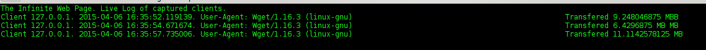

# The Infinite Web Server Honeypot

This is a quick honeypot web server that delivers an infinite web page to anyone asking **anything** from it. It sends a never ending web page that may fill up the hard disk of the attacker if the download is automatic. Also has some _sticky_ properties to try to capture the browser for as long as possible.

This new version is designed to work as a web LaBrea-style honyepot. So when the attcker connects to your honeypot, you can _stuck_ it to prevent any lateral movement in the network and you can fill the hard disk.

The new features are:
- Any web page that you ask for, will end un being infinite.
- It now uses the twisted libraries, so it supports multiple clients.
- It uses the curses libraries to show the amount of data transfered in real time.
- It can recognize GET and POST requests and give them a lot of data while trying to leave them _stuck_.
- It can recognize HEAD requests and _stuck_ them also. HEAD requests do not download data, but they can wait a long time.
- It logs everything in a file.
- The port number can be specified by a parameter.

When a client connects, the Infinite Web Server shows you its IP, its User-Agent, the requested method, the requested Path, the connection time and the real live information about the data transfered. When that client disconnects, it prints the duration of the connection.

We strongly suggest that you limit the bandwith of this honeypot, because it can eat it. Another hack can be to send less data in the code.

## Usage
Just be sure to use a wide console. If necessary make your font smaller a couple of times.
Start the infinite web page.

`
./TheInfiniteWebsite.py
`

Try it connecting with wget from your host.

`
wget localhost:8800
`

In a local network is able to send data at ~2.5Mbps

# Modifications
You can change the port where the infinite web site is running by modifying the code.

# Screenshots

